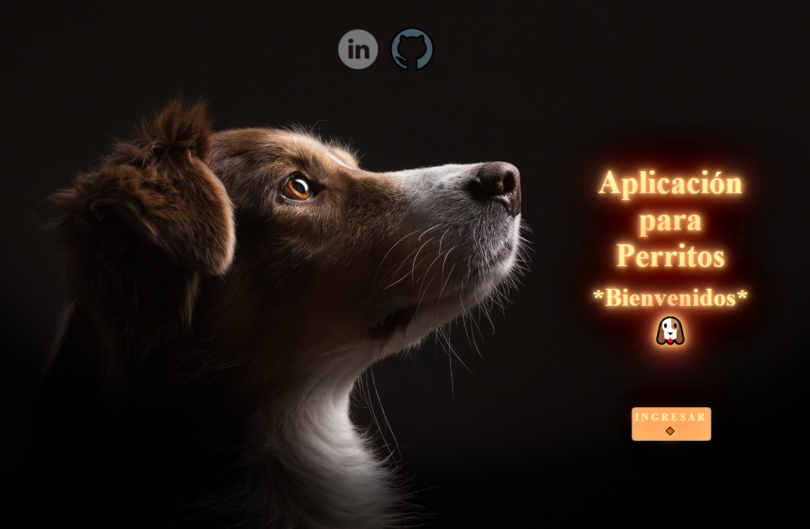
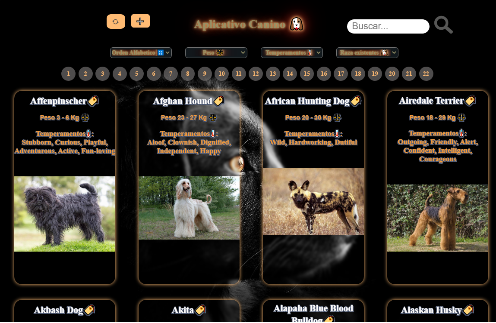
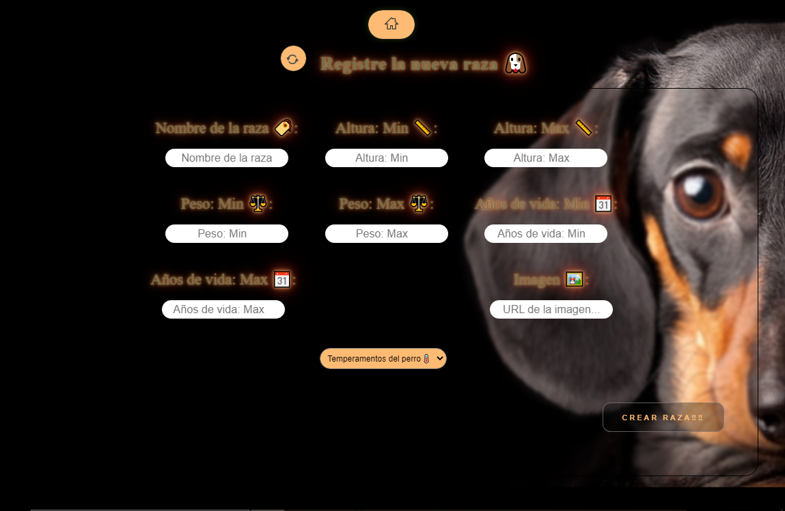
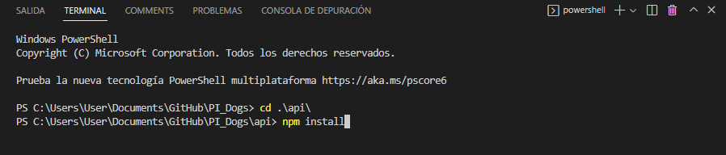
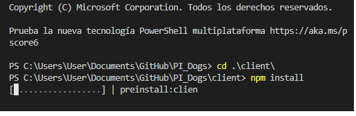
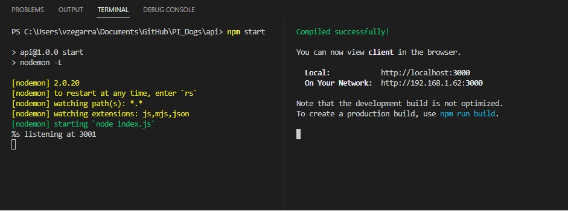

<h1 align="center">Welcome to the Dog App! 🐶</h1>
  
  
  

     
    
    
    
    
  

 

## 📋 <a name="table">Table of Contents</a>

1. 🤖 [Introduction](#introduction)
2. ⚙️ [Tech Stack](#tech-stack)
3. 🔋 [Features](#features)
4. 🤸 [Quick Start](#quick-start)
5. 🕸️ [Code Snippets to Copy](#snippets)

## <a name="introduction">🤖 Introduction</a>

An application whose purpose is to show the different canine breeds, giving the
user the different possibilities of filtering (name, breeds, temperament and weight) both existing breeds and
the new races that the user wishes to enter.

## <a name="tech-stack">⚙️ Tech Stack</a>

- Next.js
- TypeScript
- Appwrite
- Plaid
- Dwolla
- React Hook Form
- Zod
- TailwindCSS
- Chart.js
- ShadCN
# Steps to run the project:

1.- Once the project is downloaded, go to the "client" and "api" folders, to then install the packages.

    * - To access open the terminal (Control + Ñ) or (Terminal - New Terminal).
    * - Position yourself in the folder with the command: "cd ./api/"
    * - Run the command "npm install" positioned at "cd ./api/"
    

  

## NOTE: Before executing step No. 3:
It is necessary to have a database from PostgresSQL called "Dogs".

(Installation tutorial: https://youtu.be/n5Ec9bMouWQ).

(Database creation tutorial: https://youtu.be/B_lqjZGwViI).

    * - Repeat step No. 2 changing the command to position to "cd ./client/"
    * - Run the command "npm install" positioned at "cd ./client/"
    * - Open two terminals at the same time in order to correctly execute the front-end (interface) as well as the back-end (database) with the "npm start"

  

Once having both steps perfectly, we proceed to execute both environments

  

## More info about me: 

Ing. Kevin J. Montero Zea 

CE: 004712881 🆔

+51-913-695-382 📱

<a href="https://www.linkedin.com/in/kevin913montero/">
    LinkedIn 👨‍🦰
  </a>

<a href="https://portfoliokjmz.netlify.app/">
    Portfolio 💼
  </a>

