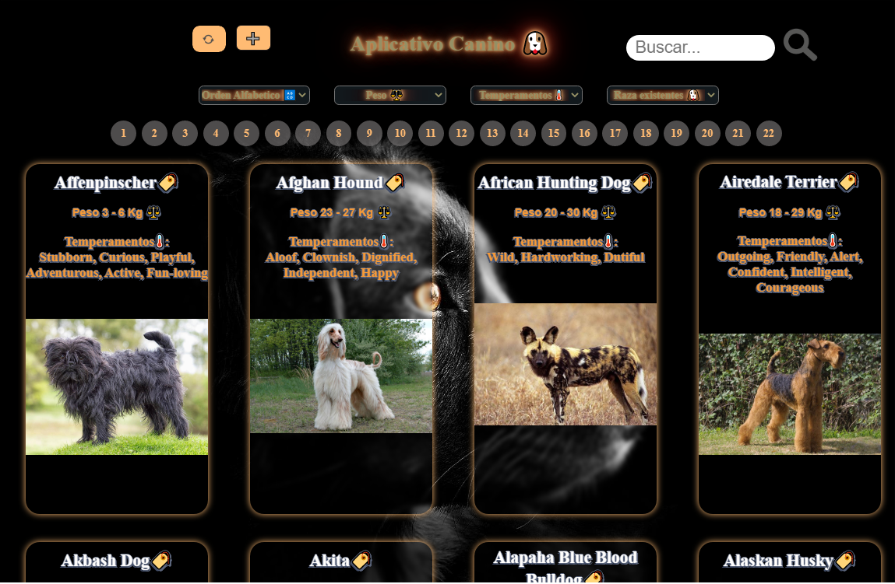
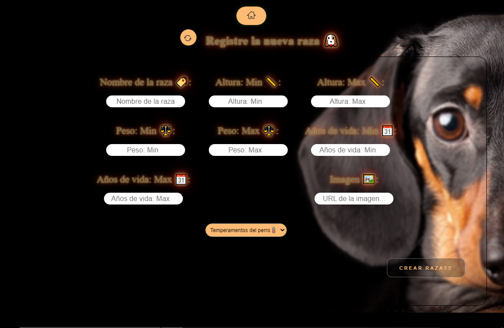
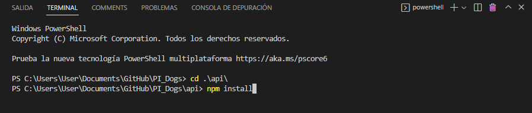

# ¡Bienvenido a la Aplicacion Canina! 🐶

Una aplicación cuya finalidad es mostrar las diferentes razas caninas, otorgandole al 
usuario las distintas posibilidades de el filtrado (nombre, razas, temperamento y peso) tanto las razas ya existente como
las nuevas razas que el usuario desee ingresar.

# Pasos para ejecutar el proyecto:

  
  
  

1.- Una vez descargado el proyecto, posicionarse en las carptes "client" y "api", para luego instalar los paquetes.

    * - Para acceder abrir la terminal (Control + Ñ) ó (Terminal - Nuevo Terminal).
    * - Posicionarse en la carpeta con el conmando: "cd ./api/"
    * - Ejecutar el comando "npm install" posicionado en "cd ./api/" 
    

  

##  NOTA: Ante des ejecutar el paso N 3:
es necesario contar con una base de datos desde PostgresSQL llamada "Dogs"
->(tutorial instalacion: https://youtu.be/n5Ec9bMouWQ)
->(tutorial creacion base de datos: https://youtu.be/B_lqjZGwViI)

2.- 
